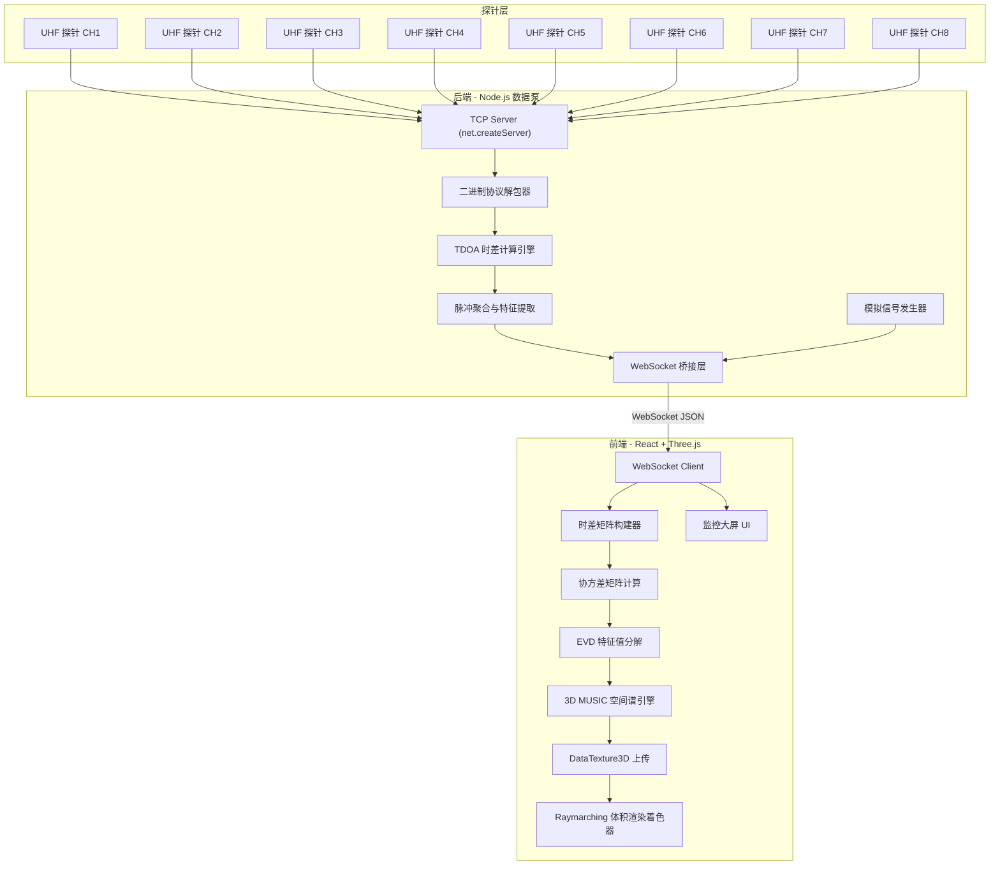
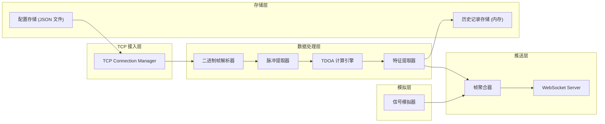
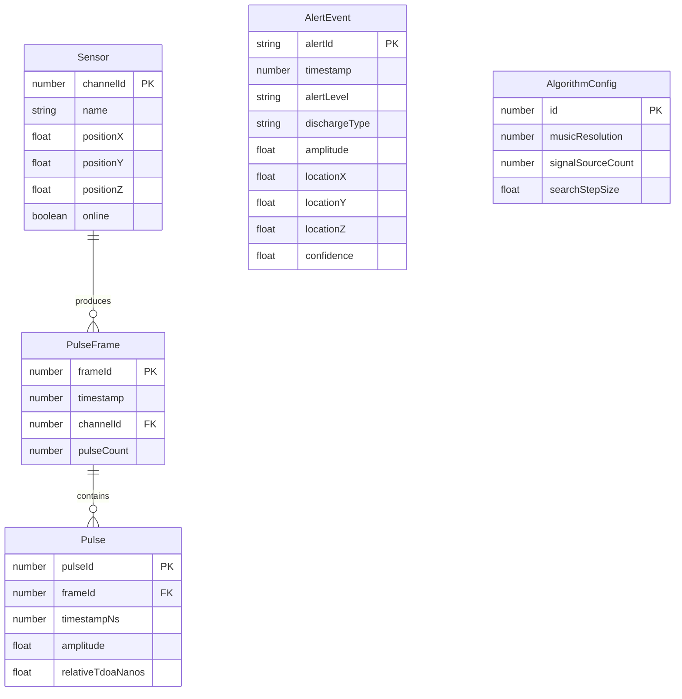

## 1. 架构设计



## 2. 技术说明

- **前端框架**：React@18 + Three.js@0.170 + @react-three/fiber@8 + @react-three/drei@9 + @react-three/postprocessing@2
- **构建工具**：Vite@5
- **样式方案**：TailwindCSS@3
- **后端运行时**：Node.js@20（ESM 模块）
- **后端框架**：ws（WebSocket 服务）+ net（TCP 原始套接字服务）
- **数值计算**：前端使用 ml-matrix 进行线性代数运算（协方差、EVD）
- **3D 渲染**：自定义 WebGL 着色器（Raymarching 体积渲染 + DataTexture3D）
- **后处理**：@react-three/postprocessing（Bloom 辉光、Vignette）
- **数据通信**：WebSocket（ws 库），JSON 格式推送脉冲帧数据
- **模拟数据**：后端内置模拟信号发生器，无物理探针时可生成仿真数据驱动前端

## 3. 路由定义

| 路由 | 用途 |
|------|------|
| `/` | 实时监控大屏（3D 电场云图 + 数据面板 + 示波器） |
| `/diagnosis` | 告警与诊断面板（局放分类、趋势曲线、告警时间线） |
| `/config` | 系统配置与历史（传感器标定、算法参数、历史回溯） |

## 4. API 定义

### 4.1 WebSocket 消息协议（后端 → 前端）

```typescript
interface PulseFrame {
  type: "pulse_frame"
  timestamp: number
  frameId: number
  channels: ChannelPulse[]
}

interface ChannelPulse {
  channelId: number
  pulseCount: number
  pulses: Pulse[]
}

interface Pulse {
  timestampNs: number
  amplitude: number
  relativeTdoaNanos: number
}

interface AlertEvent {
  type: "alert"
  alertId: string
  timestamp: number
  alertLevel: "warning" | "critical"
  dischargeType: "corona" | "surface" | "internal"
  amplitude: number
  location: { x: number; y: number; z: number }
  confidence: number
}

interface ChannelStatus {
  type: "channel_status"
  channels: {
    channelId: number
    online: boolean
    throughputHz: number
    snrDb: number
  }[]
}

type ServerMessage = PulseFrame | AlertEvent | ChannelStatus
```

### 4.2 WebSocket 消息协议（前端 → 后端）

```typescript
interface ConfigUpdate {
  type: "config_update"
  musicResolution: number
  signalSourceCount: number
  searchStepSize: number
}

interface SensorCalibration {
  type: "sensor_calibration"
  sensors: {
    channelId: number
    position: { x: number; y: number; z: number }
  }[]
}

type ClientMessage = ConfigUpdate | SensorCalibration
```

### 4.3 HTTP API

| 端点 | 方法 | 用途 |
|------|------|------|
| `/api/history` | GET | 查询历史局放记录，支持时间范围筛选 |
| `/api/history/:id/replay` | GET | 获取指定历史事件的 3D 场景快照数据 |
| `/api/config/sensors` | GET/PUT | 获取/更新传感器阵列标定配置 |
| `/api/config/algorithm` | GET/PUT | 获取/更新 MUSIC 算法参数 |
| `/api/status` | GET | 获取系统运行状态概览 |

## 5. 服务端架构图



## 6. 数据模型

### 6.1 数据模型定义



### 6.2 二进制帧协议定义

```
探针→后端 原始二进制帧格式:
┌──────────┬──────────┬──────────────┬─────────────┬──────────────┐
│ 帧头      │ 通道ID   │ 时间戳       │ 脉冲计数    │ 脉冲数据      │
│ 4 bytes  │ 2 bytes  │ 8 bytes      │ 2 bytes     │ N×16 bytes   │
│ 0xAA55F0 │ uint16   │ uint64(ns)   │ uint16      │ 见下         │
└──────────┴──────────┴──────────────┴─────────────┴──────────────┘

单个脉冲数据:
┌──────────────┬─────────────┬──────────────────┐
│ 脉冲时间戳    │ 幅值        │ 相对TDOA         │
│ 8 bytes      │ 4 bytes     │ 4 bytes          │
│ uint64(ns)   │ float32(mV) │ float32(ns)      │
└──────────────┴─────────────┴──────────────────┘
```

### 6.3 3D MUSIC 算法核心流程

```
输入: M个传感器位置 + K个脉冲的TDOA向量
1. 构建导向矢量矩阵 A(θ,φ,r) = [a(θ₁,φ₁,r₁), ..., a(θₖ,φₖ,rₖ)]
2. 计算采样协方差矩阵 R = (1/K) × Σ x×xᴴ
3. 对R进行特征值分解 R = UΣUᴴ
4. 将特征向量分为信号子空间 Us 和噪声子空间 Un
5. 对空间中每个网格点 (x,y,z):
   计算 MUSIC 谱 P(x,y,z) = 1 / (aᴴ×Un×Unᴴ×a)
6. 归一化 P 为 [0,1] 概率矩阵
7. 将 P 上传为 DataTexture3D (64³ 精度)
8. 片元着色器执行 Raymarching 体积渲染
```
